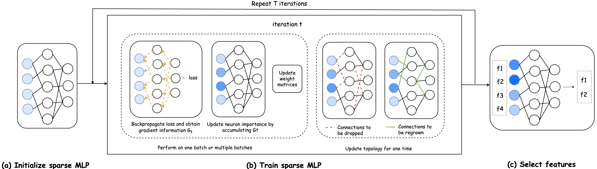

# Supervised Feature Selection via Ensemble Gradient Information from Sparse Neural Networks
Accepted by AISTATS 2024, by Kaiting Liu, Zahra Atashgahi, Ghada Sokar, Mykola Pechenizkiy, and Decebal Constantin Mocanu.

## Abstract
GradEnFS is a novel resource-efficient supervised feature selection algorithm based on a sparse multi-layer perceptron. By utilizing gradient information from various sparse models across different training iterations, our method successfully identifies informative feature subsets.

## Method

## Usage
To initiate the program, please use the command "python main.py" along with the hyperparameters of your choice.
There are some main arguments:
--dataset(string): the dataset to be used.
--epsilon(int): hyperparameters for controlling the sparsity level.
--alpha(float): pruning rate during the topology update.
--beta(float): hyperparameter for the neuron importance metric.
To view all available hyperparameters and options, you can utilize the "python main.py --help" command.

## Results

